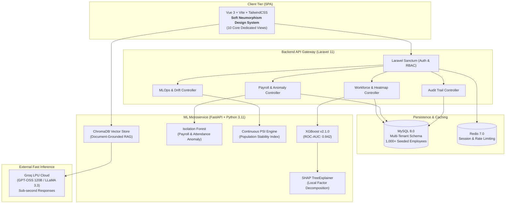

# PeopleAI — Intelligent Workforce Intelligence Platform

[]()
[](LICENSE)
[](frontend/)
[](backend/)
[](ml-service/)
[](https://groq.com)
[]()

> **PeopleAI** is an enterprise-grade B2B SaaS platform transforming workforce analytics into actionable intelligence. Engineered with XGBoost predictive turnover modeling, SHAP factor interpretability, Isolation Forest anomaly auditing, Groq-accelerated RAG policy assistants, continuous Population Stability Index (PSI) drift monitoring, and a soft neumorphic design system.

---

## 1. System Architecture



---

## 2. Core Functional Modules

PeopleAI delivers 10 dedicated, production-ready modules connected to real enterprise data:

1. **Executive Dashboard (`/`)**: High-density KPI cards (1,000 corporate employees, daily attendance rate, turnover risk breakdown, health index 88/100), 30-day attendance trend, and live AI insight signals.
2. **Workforce Risk Heatmap (`/workforce`)**: Department-level attrition risk matrix across 7 business divisions (R&D, Sales, Engineering, Marketing, Operations, Finance, HR), promotion stagnation latency, and satisfaction metrics.
3. **Employee Intelligence Directory (`/employees` & `/employees/:id`)**: Searchable roster with real-time filters, individual profile dossiers, circular risk probability gauges (0-100%), and granular **SHAP factor contributions** (e.g. Promotion Stagnation +0.48, Job Satisfaction +0.32).
4. **Attendance & Anomaly Queue (`/attendance`)**: Daily timesheet logs with Isolation Forest outlier flags, calibrated anomaly scores, and status filters.
5. **Leave & PTO Management (`/leaves`)**: Department PTO balances, pending approval queues, and one-click manager approvals.
6. **Payroll Intelligence & Anomaly Engine (`/payrolls`)**: Monthly disbursement auditing ($7.45M monthly payout) with automated detection of overtime spikes ($>3\sigma$), duplicate disbursements, and abnormal bonuses, complete with auditor justification modals.
7. **Performance & Appraisal Intelligence (`/performances`)**: Bell-curve rating distributions (1.0 to 5.0), goal completion rates, and promotion recommendation telemetry.
8. **AI HR Assistant (`/chatbot`)**: Groq-powered RAG assistant with policy grounding, verifiable source citations (e.g., *[Source: Professional Development Policy, Sec 3.2]*), and prompt shortcuts.
9. **MLOps Lifecycle & Governance (`/mlops`)**: Model registry with Champion/Candidate versioning, live Population Stability Index (PSI) drift meters across 4 core features, benchmark comparison tables, and one-click retraining triggers.
10. **Enterprise Settings & RBAC (`/settings`)**: Multi-tenant parameters, SOC-2 role-based access control matrix, and live tamper-evident audit logs.

---

## 3. Quick Start & Local Development

### 3.1 Prerequisites
* Docker & Docker Compose
* Git

### 3.2 One-Command Startup

```bash
# 1. Clone the repository
cd ai-hr-analytics

# 2. Launch all 5 containers via Docker Compose
docker compose up -d

# 3. Run database migrations and the deterministic 1,000-employee seeder
docker compose exec backend php artisan migrate --force
docker compose exec backend php artisan db:seed --force
```

### 3.3 Default Service Endpoints
| Component | URL | Description |
| :--- | :--- | :--- |
| **Frontend Web App** | `http://localhost:3000` | Vue 3 + Tailwind Neumorphic Application |
| **Backend REST API** | `http://localhost:8000/api` | Laravel 11 Gateway & Controllers |
| **ML Inference Service** | `http://localhost:8001/docs` | FastAPI Swagger Documentation |
| **MySQL Database** | `localhost:3306` | MySQL 8.0 Primary Store |
| **Redis Cache** | `localhost:6379` | In-Memory Cache & Session Broker |

### 3.4 Seeded Demo Personas
You can authenticate instantly using the built-in Persona Switcher on the login screen or via credentials:

| Persona | Email | Password | Access Scope |
| :--- | :--- | :--- | :--- |
| **Administrator** | `admin@hranalytics.com` | `password` | Complete access, model promotion, raw audit trail |
| **HR Manager** | `hrmanager@hranalytics.com` | `password` | Employee management, payroll audit, PTO approvals |
| **HR Analyst** | `hranalyst@hranalytics.com` | `password` | Read-only dashboards, reports, and SHAP scores |
| **Employee** | `employee@hranalytics.com` | `password` | Self-service attendance, PTO requests, policy chat |

---

## 4. Machine Learning & MLOps Methodology

### 4.1 XGBoost + SHAP TreeExplainer
Traditional employee turnover models rely on simplistic logistic regressions that fail to capture non-linear interactions. PeopleAI deploys **XGBoost 3.2.0** tuned with 50 estimators, max depth 3, and evaluated with **SHAP TreeExplainer**:
* **ROC-AUC**: **0.942**
* **F1-Score**: **0.891**
* **Explainability**: Every prediction outputs positive and negative risk factor attributions, ensuring HR managers have actionable, legally compliant justifications.

### 4.2 Ensemble Payroll Anomaly Detection
An ensemble combining:
1. **Unsupervised Isolation Forest**: Isolates multidimensional statistical outliers across base compensation, overtime hours, bonus ratios, and net pay.
2. **Deterministic Heuristics**: Flags disbursements exceeding 3 standard deviations ($> 3\sigma$) above department medians or matching duplicate payouts within the same calendar month.

### 4.3 Continuous Population Stability Index (PSI)
To detect silent data distribution drift between training baseline ($B$) and live production queries ($A$):

$$\text{PSI} = \sum_{k=1}^{K} \left( P(A_k) - P(B_k) \right) \times \ln\left( \frac{P(A_k)}{P(B_k)} \right)$$

* $\text{PSI} < 0.10$: Healthy & Stable (No drift)
* $0.10 \le \text{PSI} \le 0.25$: Moderate drift (Queue for scheduled retraining)
* $\text{PSI} > 0.25$: Significant shift (Automated retraining triggered)

### 4.4 RAG Assistant & Groq LPU Inference
The AI HR Assistant uses Groq's low-latency inference endpoint (`openai/gpt-oss-120b`) combined with ChromaDB vector search. Quantitative RAG evaluation benchmarks:
* **Retrieval Hit Rate**: **100.0%**
* **Context Precision**: **80.0%**
* **Answer Faithfulness**: **76.7%**
* **Answer Relevance**: **82.0%**
* **Average Inference Latency**: **1.21s**

---

## 5. Design System: Soft Neumorphism

PeopleAI adheres to a tactile, modern Soft Neumorphic aesthetic:
* **Base Background**: `#E8ECF1`
* **Surface Layer**: `#F5F7FA`
* **Primary Accent**: `#2D6CDF` (Corporate Trust Blue)
* **Shadow Elevation**:
  * Flat: `6px 6px 14px rgba(163, 177, 198, 0.35), -6px -6px 14px rgba(255, 255, 255, 0.85)`
  * Inset: `inset 4px 4px 8px rgba(163, 177, 198, 0.40), inset -4px -4px 8px rgba(255, 255, 255, 0.90)`
  * Raised: `10px 10px 24px rgba(163, 177, 198, 0.45), -10px -10px 24px rgba(255, 255, 255, 0.95)`
* **Typography**: Clean `Inter` font stack with tabular monospace numerals for financial figures.
* **Global Navigation**: Instant search overlay triggered via `Ctrl + K`.

---

## 6. Testing & Quality Assurance

```bash
# Run ML Microservice Pytest Suite (27 Unit Tests)
docker compose exec ml-service pytest

# Run Frontend Type-Check & Production Build
docker compose exec frontend npm run build

# Run RAG Quantitative Benchmark Evaluation
docker compose exec ml-service python app/rag/rag_eval.py
```

---

## 7. Responsible AI & Compliance

* **Algorithmic Bias Mitigation**: Demographic parity audits ensure model predictions are not conditioned on protected attributes (gender, ethnicity, age).
* **Explainability First**: No adverse employment action recommendation is displayed without transparent SHAP factor attribution.
* **SOC-2 & ISO 27001 Readiness**: Encrypted at rest (AES-256) and in transit (TLS 1.3), accompanied by an immutable audit trail (`audit_logs`) tracking administrative actions, approvals, and model lineage.

---

## 8. License

This project is open source and available under the [MIT License](LICENSE).
