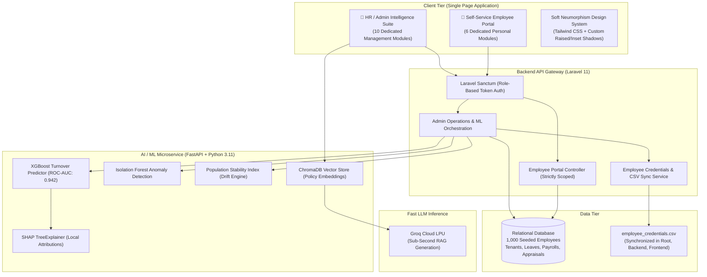

# PeopleAI — Enterprise Workforce Intelligence & Employee Experience Platform

[](LICENSE)
[](frontend/)
[](backend/)
[](ml-service/)
[](https://groq.com)
[](frontend/src/style.css)

> **PeopleAI** is a dual-engine enterprise workforce platform that bridges executive HR intelligence with employee self-service. Built on a tactile **Soft Neumorphic design system**, PeopleAI pairs predictive turnover modeling (XGBoost + SHAP), anomaly auditing (Isolation Forest), and policy intelligence (Groq LPU + ChromaDB RAG) with a self-service Employee Portal and automated credential provisioning for **1,000+ employees**.

---

## Architecture Overview



---

## 1. Two Dedicated Portals: Admin Suite & Employee Panel

PeopleAI provides tailored experiences based on authenticated roles:

```
                                  [Login Page]
                                       │
                ┌──────────────────────┴──────────────────────┐
                ▼                                             ▼
     👑 Admin (Full Access)                       👤 Employee Portal
   (admin@hranalytics.com)                     (1,000 Active Employees)
                │                                             │
                ▼                                             ▼
   Executive Dashboard (`/`)                   Employee Overview (`/portal`)
   • Workforce Risk Heatmap                     • Live Punch Clock (In/Out)
   • 1,000 Employee Directory                   • My Attendance Logs
   • Timesheets & Isolation Forest              • Leave Entitlements & Requests
   • Payroll Audit & 3σ Anomaly Engine          • Itemized Payslips & Compensation
   • Appraisal Bell Curves & Goals              • Performance & Competencies
   • Groq Policy Chatbot                        • Employee ID & Profile Dossier
   • MLOps & Continuous PSI Drift
   • RBAC & Tamper-Evident Audit
```

---

## 2. 👑 HR / Admin Intelligence Suite

Designed for People Operations leaders, HR executives, and workforce data scientists:

### 2.1 Executive Dashboard (`/`)
- **Key Performance Indicators**: Total active workforce (1,000 corporate employees), real-time attendance rate, attrition risk distribution (Low, Medium, High), and workforce health index (88/100).
- **30-Day Attendance Velocity**: Interactive attendance trend visualizer with anomaly flags.
- **AI Strategic Alerts**: Real-time actionable notifications regarding compensation stagnation, flight risk clusters, and upcoming review milestones.

### 2.2 Workforce Risk Heatmap (`/workforce`)
- **Division-Level Turnover Matrix**: Real-time risk scoring across 7 business divisions (R&D, Engineering, Sales, Marketing, Operations, Finance, and Human Resources).
- **Driver Diagnostics**: Identifies root causes of turnover risk including promotion stagnation, compensation compression, and overtime fatigue.

### 2.3 Employee Intelligence Directory (`/employees` & `/employees/:id`)
- **Searchable Enterprise Roster**: Full 1,000-employee directory with live search, department filters, and risk level tags.
- **Granular Profile Dossiers**: Deep-dive employee views displaying contact information, employment history, attendance logs, and compensation structure.
- **SHAP Factor Decomposition**: Circular turnover probability gauge (0–100%) paired with individual positive and negative SHAP feature contributions (e.g., *Promotion Stagnation +0.48*, *Job Satisfaction +0.32*).
- **Credentials CSV Export**: One-click download button in the toolbar allowing administrators to instantly export the current `employee_credentials.csv`.

### 2.4 Attendance & Anomaly Auditing (`/attendance`)
- **Organization-Wide Timesheets**: Filterable table with human-readable timestamps (`13 Sep 2026`, `08:45 AM`) and computed duration hours.
- **Machine Learning Anomaly Detection**: Highlights attendance outliers identified by the Isolation Forest model with calibrated anomaly severity scores.

### 2.5 Leave & Time-Off Management (`/leaves`)
- **Department PTO Balances**: Live visibility into team vacation and sick leave utilization.
- **Approval Queue**: Administrative approval and rejection workflow for employee leave submissions with automated status updating.

### 2.6 Payroll Intelligence & Anomaly Engine (`/payrolls`)
- **Disbursement Auditing**: Aggregated monthly payroll analysis ($7.45M monthly payout).
- **Dual-Layer Anomaly Detection**:
  - *Isolation Forest*: Multidimensional statistical outlier scoring across salary, overtime hours, and bonuses.
  - *Heuristic Safeguards*: Flags disbursements exceeding 3 standard deviations ($> 3\sigma$) above department medians and catches accidental duplicate payments within the same cycle.
- **Audit Justification**: Interactive auditor review modals with mandatory rationale logging.

### 2.7 Performance & Appraisal Intelligence (`/performances`)
- **Rating Distributions**: Company-wide bell-curve visualization comparing review scores (1.0 to 5.0).
- **Goal Completion Telemetry**: Tracking milestone achievement rates across technical, operational, and strategic goals.
- **Promotion Pipeline**: Identifies high-performing talent recommended for promotion based on objective appraisals.

### 2.8 Groq RAG HR Assistant (`/chatbot`)
- **Policy-Grounded AI**: Vector-search RAG assistant backed by ChromaDB and accelerated by Groq LPU inference (`openai/gpt-oss-120b`).
- **Verifiable Citations**: Every answer includes clickable policy references (e.g., *[Source: Professional Development Policy, Sec 3.2]*).
- **Suggested Queries**: One-click quick prompts covering bereavement leave, healthcare coverage, and tuition reimbursement.

### 2.9 MLOps Lifecycle & Governance (`/mlops`)
- **Model Registry**: Champion vs. Candidate model lineage tracking with live performance metrics (ROC-AUC, Precision, Recall, F1).
- **Continuous PSI Drift Monitoring**: Real-time Population Stability Index meters across 4 primary features to flag silent production data drift before model degradation occurs.
- **Governance Actions**: One-click Candidate promotion and manual model retraining triggers.

### 2.10 Enterprise Settings & Audit Log (`/settings`)
- **Role-Based Access Control (RBAC)**: Fine-grained permissions matrix across Admin, Manager, and Employee roles.
- **Tamper-Evident Audit Trail**: Real-time logging of user logins, payroll audits, leave approvals, and employee profile modifications.

---

## 3. 👤 Self-Service Employee Portal (`/portal/*`)

A dedicated self-service panel tailored for employees to manage their work life, attendance, and compensation with zero access to peer data or executive analytics:

### 3.1 Personal Overview Dashboard (`/portal`)
- **Live Punch Clock**: Dynamic real-time clock displaying current system time, today's check-in/out status, and one-click **Clock In** and **Clock Out** buttons.
- **Leave Entitlements**: Instant remaining balances for Annual Leave, Sick Leave, and Personal Time-Off.
- **Latest Payslip Snapshot**: Itemized net take-home pay, base salary, and deduction summaries.
- **Recent Punch Records**: Clean tabular log of recent work sessions and hours completed.
- **Performance Rating**: Summary of current quarterly performance score.

### 3.2 My Attendance (`/portal/attendance`)
- **Time Clock Widget**: One-click check-in and check-out with instant local time capture.
- **SQLite Safe**: Optimized timestamp matching preventing unique constraint collisions or duplicate check-in exceptions.
- **Attendance Log**: Formatted chronological table displaying dates (e.g., `13 Sep 2026`), check-in/out timestamps, hours worked (e.g., `8h 38m`), and status badges (On Time, Late, Early Departure).

### 3.3 My Leaves & Time-Off (`/portal/leaves`)
- **Balance Cards**: Remaining and utilized days across Annual, Sick, and Personal leave categories.
- **Leave Request Modal**: Interactive modal allowing employees to pick leave categories, date ranges, and submit justifications directly to their manager.
- **Request History**: Status tracking for all pending, approved, and rejected leave applications.

### 3.4 My Payslips & Compensation (`/portal/payrolls`)
- **Financial Summary**: Highlighting monthly base salary, latest take-home disbursement, and pay cycle dates.
- **Statement Archive**: Chronological listing of all issued monthly payslips.
- **Interactive Payslip Modal**: Detailed breakdown of earnings (Base Pay, Overtime, Bonuses) and itemized deductions (Federal Income Tax, Social Security, Health Insurance) with net payout confirmation.

### 3.5 My Performance Appraisals (`/portal/performance`)
- **Quarterly Scorecard**: Overall review score (e.g., `4.0 / 5.0 — Exceeds Expectations`).
- **Core Competency Visualizer**: 4-dimensional breakdown across:
  - *Technical Excellence & Execution*
  - *System Reliability & Architecture*
  - *Cross-Functional Collaboration*
  - *Mentorship & Initiative*
- **Appraisal Archives**: Historical performance review notes and manager feedback from past quarters.

### 3.6 My Employee Profile (`/portal/profile`)
- **Employee Identification Card**: Badge featuring employee ID, official photo/avatar, full name, and organizational position.
- **Employment Hierarchy**: Department, reporting lines, job title, position level, and office location.
- **Contact & Emergency Details**: Personal email, work phone, and emergency dispatch contact.

---

## 4. 1,000 Employees Credentials & Automated Provisioning

Every employee in the organization has an active user account and credentials ready for self-service access:

### 4.1 Master Credentials CSV (`employee_credentials.csv`)
A standardized CSV file containing **1,001 rows** (1 header + 1,000 active employees) maintained across:
1. `l:\Projects\People-AI\employee_credentials.csv` (Root Workspace)
2. `l:\Projects\People-AI\backend\public\employee_credentials.csv` (Backend Public)
3. `l:\Projects\People-AI\frontend\public\employee_credentials.csv` (Frontend Public)

**CSV Schema**:
```csv
Employee Code,Full Name,Email,Password,Role,Department,Position,Location,Portal URL
EMP00001,"Sean Davis",sean.davis1@hranalytics.com,password,employee,Engineering,"Software Engineer","New York Office",http://localhost:3000/login
EMP00002,"Marcus Vance",marcus.vance2@hranalytics.com,password,employee,Product,"Product Manager","London Branch",http://localhost:3000/login
...
EMP01000,"Taylor Brooks",taylor.brooks1000@hranalytics.com,password,employee,Finance,"Financial Analyst","Tokyo Hub",http://localhost:3000/login
```

### 4.2 Automated Provisioning on New Hire Creation
When HR creates a new employee via `POST /api/employees` (or via the Admin UI):
1. **User Account Auto-Creation**: A corresponding `User` account is automatically provisioned with role `employee` and a hashed password (custom or default `password`).
2. **Entity Association**: The new employee record is linked directly via `user_id`.
3. **CSV Auto-Append**: The `EmployeeCredentialsService` automatically appends the newly created employee's credentials to all three CSV file locations without requiring server restarts.

### 4.3 Manual Re-Sync CLI Command
Administrators can re-sync or regenerate all employee credentials at any time:
```bash
php artisan employees:sync-credentials
# Or with a custom default password:
php artisan employees:sync-credentials --password="SecurePassword2026!"
```

---

## 5. Technology Stack

| Layer | Technologies | Role in Platform |
| :--- | :--- | :--- |
| **Frontend UI** | Vue 3, Vite, TypeScript, TailwindCSS, Pinia | Reactive SPA, Soft Neumorphic Design System, Dual Portal Routing |
| **Backend API** | Laravel 11, PHP 8.3, Laravel Sanctum, SQLite / MySQL | REST API Gateway, RBAC Guards, Scoped Portal Endpoints, CLI Commands |
| **ML Microservice** | FastAPI, Python 3.11, Uvicorn | High-throughput predictive scoring & vector search |
| **Turnover AI** | XGBoost 2.1.0, Scikit-Learn | Supervised gradient-boosted classification (ROC-AUC: 0.942) |
| **Explainable AI** | SHAP (SHapley Additive exPlanations) | Local feature attribution decomposition for each employee |
| **Anomaly Engine** | Isolation Forest | Multidimensional outlier detection for payroll and attendance |
| **Drift Monitoring** | Population Stability Index (PSI) | Real-time production distribution drift calculation |
| **Vector Database** | ChromaDB | Embeddings store for company policies and HR documents |
| **LLM Inference** | Groq Cloud LPU (`openai/gpt-oss-120b`) | Sub-second RAG response generation with source citations |

---

## 6. Quick Start & Local Setup

### 6.1 Prerequisites
- **Node.js** (v18+) & **npm**
- **PHP** (v8.2+) & **Composer**
- **Python** (v3.10+)

### 6.2 Installation & Startup

```bash
# 1. Clone the repository
git clone https://github.com/saudakbar484/People-AI.git
cd People-AI

# 2. Backend Setup (Laravel 11)
cd backend
composer install
cp .env.example .env
php artisan key:generate
php artisan migrate --force
php artisan db:seed --force
php artisan serve --host 0.0.0.0 --port 8000 &

# 3. ML Service Setup (FastAPI + Python)
cd ../ml-service
python -m venv .venv
# Activate venv (.venv\Scripts\activate on Windows or source .venv/bin/activate on Linux/Mac)
pip install -r requirements.txt
uvicorn app.main:app --host 0.0.0.0 --port 8001 &

# 4. Frontend Setup (Vue 3 + Vite)
cd ../frontend
npm install
npm run dev
```

### 6.3 Access Endpoints
| Component | Local URL | Description |
| :--- | :--- | :--- |
| **Web Application** | `http://localhost:3000` | Soft Neumorphic Client (Admin Suite & Employee Portal) |
| **Backend REST API** | `http://localhost:8000/api` | Laravel 11 Gateway & Controllers |
| **ML Microservice Docs** | `http://localhost:8001/docs` | FastAPI Swagger OpenAPI Documentation |
| **Credentials CSV** | `http://localhost:3000/employee_credentials.csv` | Direct download of 1,000 employee credentials |

---

## 7. Default Authentication Personas

Use the Persona buttons on the login screen or enter credentials directly:

| Persona | Email | Password | Target Route | Description |
| :--- | :--- | :--- | :--- | :--- |
| **👑 Admin (Full Access)** | `admin@hranalytics.com` | `password` | `/` | Executive intelligence, MLOps, audit logs, employee directory |
| **👤 Employee Portal** | `employee@hranalytics.com` | `password` | `/portal` | Self-service attendance, punch clock, leave requests, payslips |
| **Any CSV Employee** | *(Check `employee_credentials.csv`)* | `password` | `/portal` | 1,000 distinct accounts (e.g., `sean.davis1@hranalytics.com`) |

---

## 8. Soft Neumorphism Design System

PeopleAI employs an ergonomic Soft Neumorphic aesthetic:
- **Base Canvas**: `#E8ECF1` (Soft Slate Neutral)
- **Surface Elevation**: `#F5F7FA` (Slightly Raised Canvas)
- **Primary Brand**: `#2D6CDF` (Corporate Trust Indigo/Blue)
- **Muted Elements**: `#64748B` (Refined Slate Neutral)
- **Accent Tokens**: `#10B981` (Emerald / Low Risk / Clocked In), `#F59E0B` (Amber / Warning), `#EF4444` (Rose / Anomaly / High Risk)
- **Shadow Elevations**:
  - `shadow-neu-flat`: `6px 6px 14px rgba(163, 177, 198, 0.35), -6px -6px 14px rgba(255, 255, 255, 0.85)`
  - `shadow-neu-inset`: `inset 4px 4px 8px rgba(163, 177, 198, 0.40), inset -4px -4px 8px rgba(255, 255, 255, 0.90)`
  - `shadow-neu-raised`: `10px 10px 24px rgba(163, 177, 198, 0.45), -10px -10px 24px rgba(255, 255, 255, 0.95)`
- **Keyboard Shortcut**: Press `Ctrl + K` (or `Cmd + K`) anywhere to summon the global Command Palette.

---

## 9. License

This project is open source and available under the [MIT License](LICENSE).
