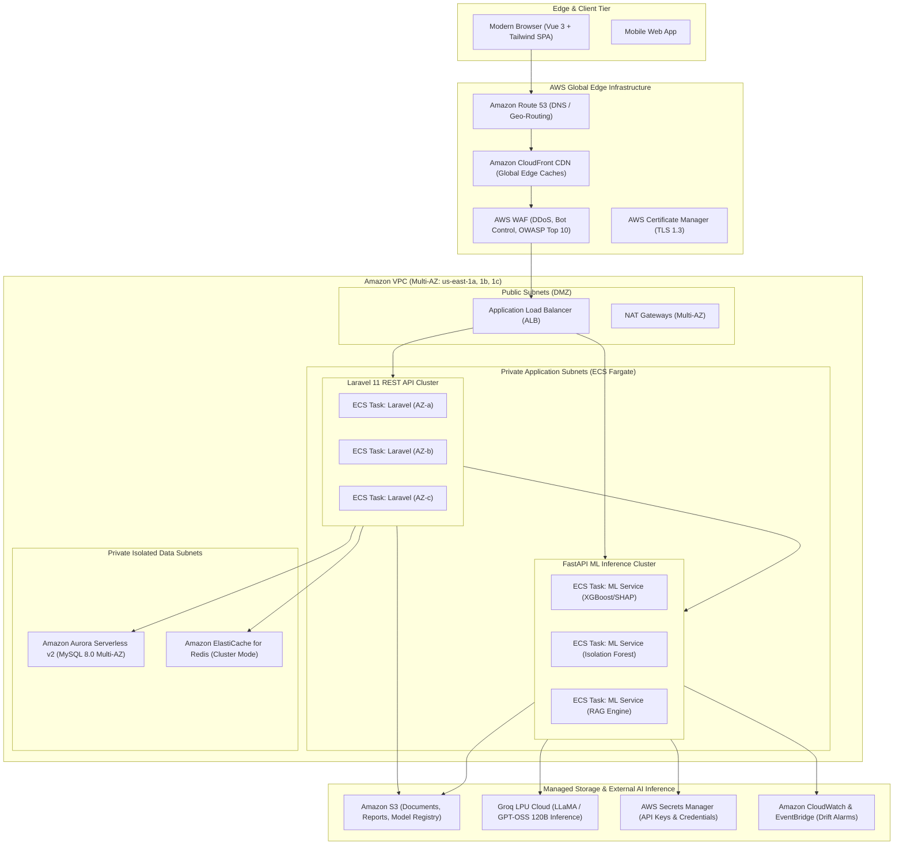

# PeopleAI Enterprise Architecture & AWS Cloud Deployment Blueprint

This document specifies the enterprise-grade production cloud architecture for **PeopleAI — Intelligent Workforce Intelligence Platform**, engineered for multi-tenant isolation, SOC-2 / ISO 27001 compliance, 99.99% high availability, and sub-second AI inference.

---

## 1. High-Level Architecture Diagram



---

## 2. Infrastructure Components Breakdown

### 2.1 Edge & Content Delivery Tier
* **Amazon CloudFront**: Caches and distributes the static Vue 3 / Vite assets globally with sub-20ms latency. Configured with strict Content Security Policy (CSP), HTTP/3 support, and automated cache invalidation on deployment.
* **AWS WAF**: Layer 7 inspection defending against SQL injection, cross-site scripting (XSS), credential stuffing, and volumetric layer 7 floods.
* **AWS Certificate Manager (ACM)**: Automated certificate generation, TLS 1.3 negotiation, and zero-downtime rotation.

### 2.2 Container Orchestration & Microservices (AWS ECS Fargate)
* **Compute Engine**: AWS Fargate (Serverless Containers), eliminating EC2 patch overhead and infrastructure management.
* **Target Tracking Auto-Scaling**:
  * **Laravel Backend API**: Auto-scales based on average target request count (1,500 req/min/task) and CPU utilization (> 65%). Min tasks: 3, Max tasks: 30.
  * **FastAPI ML Service**: Auto-scales based on P95 inference latency (> 150ms) and active worker thread count. Min tasks: 3, Max tasks: 20.
* **Service Mesh & Service Discovery**: AWS Cloud Map for zero-trust private service communication between Laravel and FastAPI (`http://ml-service.local:8001`).

### 2.3 Managed Data & Persistence Layer
* **Amazon Aurora MySQL Serverless v2**:
  * Dual-AZ primary with continuous auto-scaling from 0.5 to 16 Aurora Capacity Units (ACUs).
  * Read replicas in AZ-b and AZ-c for horizontal analytical read scaling and instantaneous failover (< 30s).
  * Storage: Auto-expanding NVMe storage with automated 35-day point-in-time recovery (PITR) and hourly encrypted snapshots.
* **Amazon ElastiCache for Redis**:
  * Redis Cluster with Multi-AZ automated failover and in-transit / at-rest encryption (AES-256).
  * Used for: user session tokens (Laravel Sanctum), rate-limiting tokens, cache of SHAP explanations, and workforce query caches.
* **Amazon Simple Storage Service (S3)**:
  * S3 Standard with Lifecycle policies to Intelligent-Tiering and Glacier Instant Retrieval.
  * Buckets:
    1. `peopleai-documents-{env}`: PDF policies and HR handbooks for vector grounding.
    2. `peopleai-reports-{env}`: Exported PDF/CSV compliance briefs.
    3. `peopleai-model-registry-{env}`: Serialized model weights (`turnover_xgboost_v2.1.0.joblib`).

---

## 3. Machine Learning & MLOps In-Cloud Governance

### 3.1 Population Stability Index (PSI) Drift Telemetry
* A continuous CloudWatch EventBridge cron invokes `/api/v1/models/drift` every 6 hours.
* If any primary feature (Salary, Job Satisfaction, Promotion Stagnation, Unscheduled Absences) exhibits a PSI score exceeding **0.25**, a high-priority CloudWatch Alarm publishes to an AWS SNS topic:
  * Triggers an automated AWS Step Functions workflow to pull latest snapshot data from Aurora, invoke `POST /api/v1/models/retrain`, validate benchmark ROC-AUC >= 0.90, and promote candidate model to champion.
  * Dispatches an alert webhook to corporate Slack/Teams.

### 3.2 Secure LLM Inference Connectivity
* Groq API keys and database credentials are stored in **AWS Secrets Manager** with automatic rotation.
* Outbound traffic from private subnets traverses AWS NAT Gateways across multiple AZs to ensure egress redundancy.

---

## 4. SOC-2 & ISO 27001 Compliance Controls

| Category | Control Implementation |
| :--- | :--- |
| **Data in Transit** | Forced HTTPS / TLS 1.3 across CloudFront, ALB, and internal microservice mesh. |
| **Data at Rest** | AWS KMS (Key Management Service) with customer-managed keys (CMK) across Aurora, S3, and ElastiCache. |
| **Immutable Audit Logging** | AWS CloudTrail logs all AWS API actions; internal Laravel audit log (`audit_logs` table) records all user approvals and model promotions. |
| **Least Privilege Access** | Fine-grained IAM task execution roles; no root credentials; AWS IAM Identity Center (SSO) for administrative access. |
| **Disaster Recovery** | RPO < 1 minute (continuous Aurora redo log stream), RTO < 15 minutes (automated cross-AZ task redeployment). |

---

## 5. Terraform Infrastructure-as-Code (Blueprint Outline)

```hcl
module "vpc" {
  source  = "terraform-aws-modules/vpc/aws"
  version = "~> 5.0"

  name = "peopleai-production-vpc"
  cidr = "10.0.0.0/16"

  azs             = ["us-east-1a", "us-east-1b", "us-east-1c"]
  public_subnets  = ["10.0.1.0/24", "10.0.2.0/24", "10.0.3.0/24"]
  private_subnets = ["10.0.10.0/24", "10.0.20.0/24", "10.0.30.0/24"]
  database_subnets= ["10.0.100.0/24", "10.0.200.0/24", "10.0.300.0/24"]

  enable_nat_gateway = true
  single_nat_gateway = false
  enable_vpn_gateway = false

  tags = {
    Environment = "production"
    Application = "peopleai"
  }
}

module "aurora" {
  source  = "terraform-aws-modules/rds-aurora/aws"
  version = "~> 9.0"

  name           = "peopleai-aurora-mysql"
  engine         = "aurora-mysql"
  engine_version = "8.0.mysql_aurora.3.05.2"
  instance_class = "db.serverless"

  instances = {
    one = {}
    two = {}
  }

  serverlessv2_scaling_configuration = {
    min_capacity = 0.5
    max_capacity = 16.0
  }

  vpc_id  = module.vpc.vpc_id
  subnets = module.vpc.database_subnets

  storage_encrypted   = true
  apply_immediately   = false
  monitoring_interval = 60
}
```
