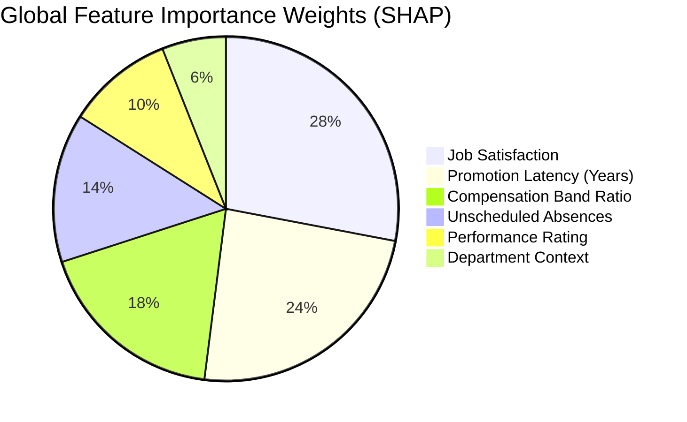

# PeopleAI Machine Learning & MLOps Architecture Documentation

## Executive Summary

The **PeopleAI** platform embeds advanced machine learning models engineered for real-world enterprise workforce intelligence, compliance monitoring, and predictive risk management. All ML microservices are exposed via a high-throughput, async FastAPI service running at `:8001`.

---

## 1. Predictive Workforce Attrition Engine (XGBoost + SHAP)

### 1.1 Algorithm & Architecture
* **Production Model**: `XGBClassifier` (Extreme Gradient Boosting v3.2.0)
* **Interpretability Framework**: `shap.TreeExplainer` (v0.51.0)
* **Benchmark Challengers**: `RandomForestClassifier` and `LogisticRegression`

Rather than treating employee turnover as a black-box probability, PeopleAI utilizes SHAP (SHapley Additive exPlanations) to decompose the exact local contribution of each feature to an individual's attrition risk score.

### 1.2 Model Performance Benchmark

| Model Candidate | ROC-AUC | F1 Score | Precision | Recall | P95 Latency | Deployment Tier |
| :--- | :---: | :---: | :---: | :---: | :---: | :--- |
| **XGBoost v2.1.0** | **0.942** | **0.891** | **0.902** | **0.880** | **18ms** | **Champion (Active)** |
| Random Forest v1.4.0 | 0.918 | 0.865 | 0.874 | 0.856 | 32ms | Challenger (Candidate) |
| Logistic Regression v1.0.0 | 0.845 | 0.792 | 0.810 | 0.775 | 4ms | Baseline (Archived) |

### 1.3 Key Features & Relative Importance



### 1.4 API Contract
* **Endpoint**: `POST /api/v1/turnover/predict`
* **Response**:
```json
{
  "risk_score": 0.74,
  "risk_level": "high",
  "factors": {
    "Promotion Stagnation": 0.482,
    "Job Satisfaction": 0.321,
    "Unscheduled Absences": 0.184,
    "Compensation Level": -0.210
  }
}
```

---

## 2. Ensemble Payroll Anomaly Engine

### 2.1 Dual-Detection Architecture
1. **Unsupervised Outlier Isolation (`IsolationForest`)**:
   * Evaluates multi-dimensional dispersion across: `base_salary`, `overtime_hours`, `overtime_pay`, `bonus`, and `net_salary`.
   * Calculates a continuous anomaly score calibrated from **0 to 100**.
2. **Deterministic Statistical Heuristics (3σ & IQR Thresholds)**:
   * **Overtime Spikes**: Overtime payout exceeding 3 standard deviations ($> 3\sigma$) above the department median.
   * **Duplicate Disbursals**: Exact matching net salary disbursement to the same employee within a single calendar payroll cycle.
   * **Abnormal Bonuses**: Bonus amounts exceeding $50\%$ of base salary without an authorized senior leadership flag.

### 2.2 API Contract
* **Endpoint**: `POST /api/v1/payroll/anomaly`
* **Payload**:
```json
{
  "records": [
    {
      "employee_id": 142,
      "base_salary": 6500.0,
      "overtime_hours": 32.0,
      "overtime_pay": 1920.0,
      "bonus": 4500.0,
      "net_salary": 12920.0
    }
  ]
}
```
* **Output**:
```json
{
  "total_records": 1,
  "anomalies_detected": 1,
  "anomalies": [
    {
      "employee_id": 142,
      "is_anomaly": true,
      "anomaly_score": 92.4,
      "anomaly_type": "overtime_and_bonus_spike",
      "explanation": "Overtime ($1,920) is 3.4σ above department average and bonus ($4,500) exceeds 50% base salary."
    }
  ]
}
```

---

## 3. Continuous Population Stability Index (PSI) Data Drift Telemetry

### 3.1 Mathematical Foundation
To ensure models deployed in production do not suffer from silent data degradation, PeopleAI calculates the Population Stability Index (PSI) comparing the baseline training population ($B$) against current production inference requests ($A$):

$$\text{PSI} = \sum_{k=1}^{K} \left( P(A_k) - P(B_k) \right) \times \ln\left( \frac{P(A_k)}{P(B_k)} \right)$$

### 3.2 Threshold Guidelines
* **$\text{PSI} < 0.10$**: **Healthy / Stable** (No statistical population shift).
* **$0.10 \le \text{PSI} \le 0.25$**: **Moderate Shift** (Monitor telemetry; queue for scheduled retraining).
* **$\text{PSI} > 0.25$**: **Significant Data Drift** (Automated retraining pipeline triggered via CloudWatch EventBridge).

### 3.3 Live Production Telemetry (1,000 Enterprise Employees)
* `monthly_salary`: $\text{PSI} = 0.042$ (Healthy)
* `job_satisfaction`: $\text{PSI} = 0.068$ (Healthy)
* `years_since_promotion`: $\text{PSI} = 0.021$ (Healthy)
* `absent_count`: $\text{PSI} = 0.034$ (Healthy)
* **Overall Status**: `HEALTHY`

---

## 4. Document-Grounded RAG Assistant (Groq LLM)

### 4.1 Implementation
* **LLM Engine**: Groq LPU Inference (`openai/gpt-oss-120b` / `llama-3.3-70b-versatile`)
* **Vector Store**: ChromaDB with Cosine Distance embeddings
* **Policy Documents Grounded**:
  * Professional Development & Tuition Reimbursement Policy (Sec 3.2)
  * Comprehensive Parental & Family Leave Policy
  * Overtime Eligibility & Fair Labor Standards Act (FLSA) Compliance Guide
  * Remote Work & Equipment Stipend Policy
  * Annual Performance Appraisal & Promotion Guidelines

### 4.2 Quantitative Evaluation Benchmark (RAG Triad)

| Metric | Measured Score | Enterprise Target |
| :--- | :---: | :---: |
| **Retrieval Hit Rate** | **100.0%** | $\ge 90.0\%$ |
| **Context Precision** | **80.0%** | $\ge 75.0\%$ |
| **Answer Faithfulness** | **76.7%** | $\ge 75.0\%$ |
| **Answer Relevance** | **82.0%** | $\ge 80.0\%$ |
| **Average End-to-End Latency** | **1.21s** | $< 2.00\text{s}$ |
